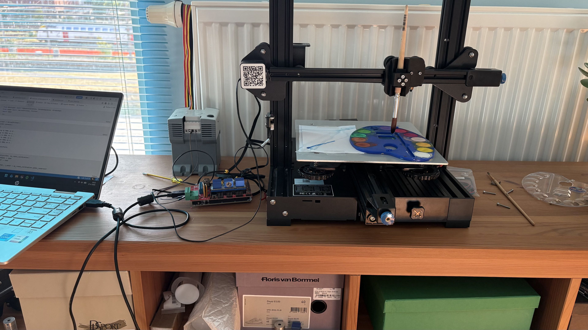
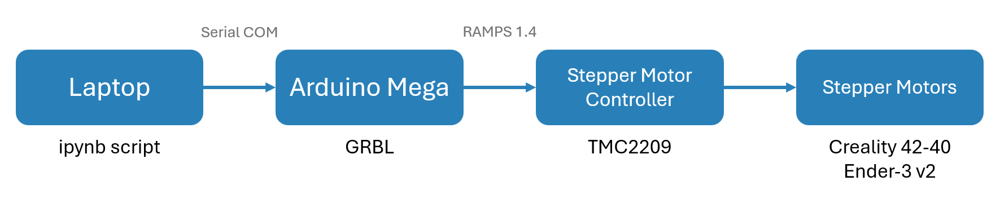

# Hardware 

In this chapter we will give a short introduction to our setup. We will discuss the components used and how to install the software.

## Overview

Our computer wants to send instructions to our printer. More specifically, we want to tell the printer precisely which position to move to.
To achieve this, the computer connects to an Arduino using a serial communication (a usb port).
Then we can send very simple command such as `G0 X10 Y20 Z30` to move the printer to position `(10, 20, 30)`.
A list of valid commands can be found below.
The arduino then controlls its GPIO pins to tell the stepper motor drivers how often to step and in which direction.
The stepper motor drivers will close the A and B loops of the physical stepper motor itself to make the stepper motors move.

In order to hold the brush, some parts had to be 3d printed.
See [3d prints](3d_prints.md).

## Part list

If one wants to copy our setup, the following parts will definetelly be required.

| Part name | Short Description |
| :--- | :--- |
| <a href="https://store-usa.arduino.cc/products/arduino-mega-2560-rev3">Arduino Mega 2560 Rev3</a> | Accepts GRBL commands and interacts with the stepper motor drivers. |
| TMC2208 | The stepper motor driver. |
| Ender-3 v2 | This is the backbone we use for the entire hardware. |
| Creality 42-40 | This can be an alternative for buying the entire printer. |
| 24V 2.5A Power supply | The arduino can not deliver enough power for the stepper motors. |
| <a href="https://www.123-3d.nl/123-3D-RAMPS-v1-4-volledig-geassembleerd-i364.html?utm_source=google&utm_medium=organic&utm_campaign=free-listings&utm_term=DRW00008">RAMPS 1.4</a> | This board is placed on top of the Arduino, to connect the GPIO pins to the stepper motor controllers. On the board are also capacitors to regulate the voltage. |

!!! failure "This list is a suggestion"
    The parts in the above list are those that we used in our setup. All of them could be replaced with an alternative. You could, for example, use an Arduino Uno with the <a href="https://www.123-3d.nl/123-3D-Arduino-CNC-shield-v3-grbl-compatible-i1991.html?utm_source=google&utm_medium=organic&utm_campaign=free-listings&utm_term=DRW00016">Arduino Uno CNC board</a>.

## Marlin Software

The Arduino Mega is equiped with the latest <a href="https://github.com/marlinfirmware/marlin">Marlin software</a>.
We found it most conventient to upload this using the `PlatformIO` extension for vscode, altough that is
a personal preference after all.

Note that when making changes to the configuration file of the Marlin software, the changes will not take place
immediatly after upload. Indeed, the program uses EEPROM to save settings into persistent memory. You need to send `$RST` in order to reset the settings.

## Commands

Our Marlin software will accept most of the GCODE commands, plus some GRBL-specific commands.
We shortly go over the most important commands. See the source for a full list of all commands.

| GCODE command | Description |
| :--- | :--- |
| `G0` / `G1` | **Move** – Move to a specified position in 3d space. |
| `G28` | **Home** – Do a calibration routine to reset the relative position to the hard limits. |

Source: <a href="https://reprap.org/wiki/G-code">reprap: G-code</a>

| GRBL Command | Description |
| :--- | :--- |
| `$$` | **View all settings** – Displays the current values of all Grbl configuration parameters. |
| `$#` | **View coordinate offsets** – Shows the current G54–G59 work coordinate offsets and any programmed tool or probe offsets. |
| `$G` | **View modal state** – Displays the active G-code modes (e.g., G21, G90, G54). Helpful for debugging command behavior. |
| `$I` | **Build info** – Returns firmware version and any build metadata (optional). |
| `$H` | **Run homing cycle** – Initiates a homing routine if homing is enabled in settings (`$22=1`). |
| `!` | **Feed hold** – Pauses motion immediately but safely. Can be resumed with `~`. |
| `?` | **Status report** – Asks Grbl to send back a real-time status report. Can be sent repeatedly. |

Source: <a href="https://support.easel.com/hc/en-us/articles/40531696895123-Grbl-v1-1-System-Commands-Commands">easel: Grbl v1.1 System Commands</a>