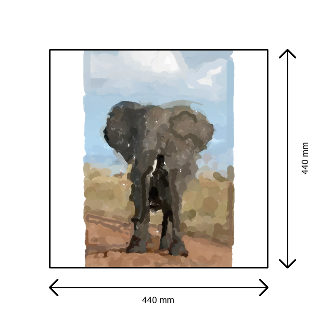

# Paint Robot

Welcome to the Paint Robot documentation! This is a Python-based research and implementation project for paint robot control and optimization.

    

## License

This project is licensed under the MIT License - see the [License](license.md) page for details.
