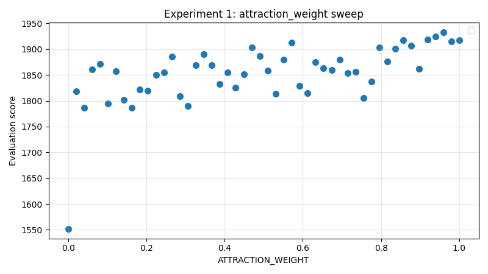
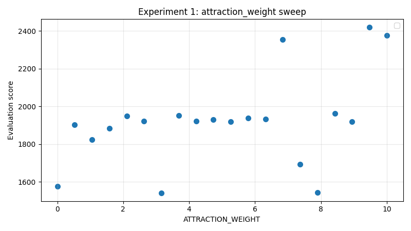

# Experiment 1: Attraction Weight

## About

The `attraction weight` was a mathematical incentive for a stroke to expand towards an area that was not covered yet.

In this experiment we will show that this attraction
has a rathe negative impact, and will thus not be included
in future implementations.

## The results

Altough the results were not significant,
we conclude that there is no positive result
of an attraction weight.

