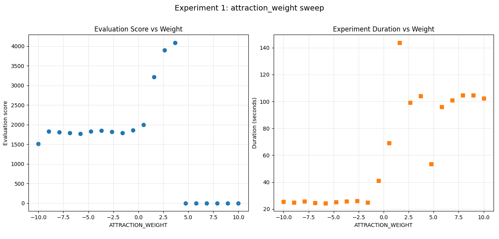
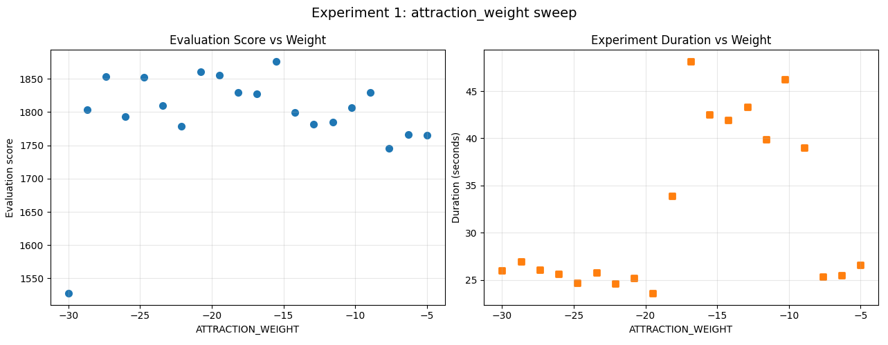

# Experiment 1: Attraction Weight

## About

How strict should we be in stroke selecting.
Against our expectations, this was *not* a 
choice between quality and performance.

## The results

We selected -2.5 sigma.