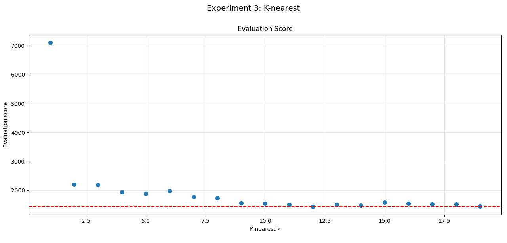
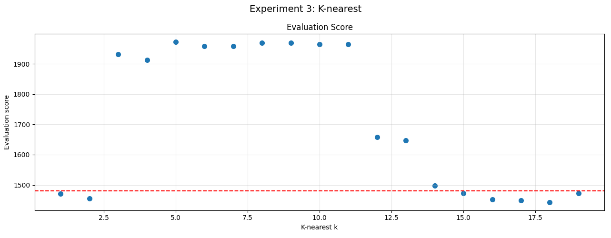
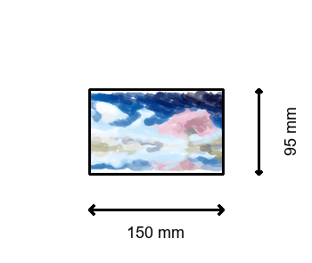

# Experiment 3

## About

We considered two methods for what we call a `color method`.
Note that we cannot have a different color for each brush stroke.
Which colors can be considered by the algorithm?

A possible color method could be to allow only the 
colors are available in the color palette.
This is easy, but but doenst use the palette to its fullest potential.

A second method is to perform k-nearest
on the image first.
After that, we allow all colors, in the k-nearest
image.

## Results

Below is an example, to show that
this might indeed be a good solution.

