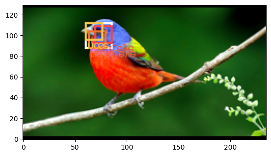
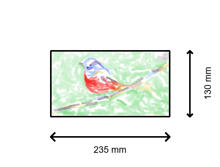

# Face Features

## About

We noticited that our animals and humans werent quite recognizable
by the human eye. This was mostly due to missing eyes and other face features. Indeed, we humans focus a lot on eyes.

Therefore, we implemented a machine learning model which locates face features. This model works with pictures of humans and animals in general.

We then draw a small black dot at the location of the eyes and mouth.

## Results

