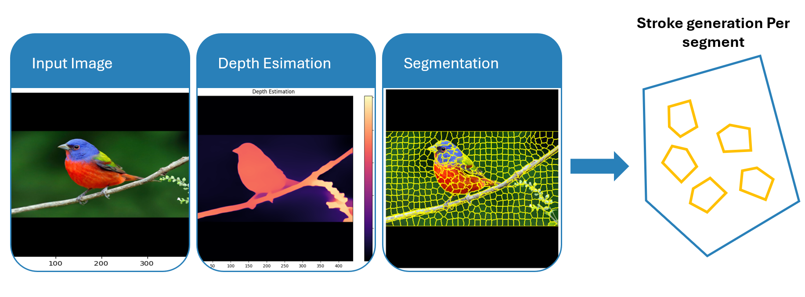
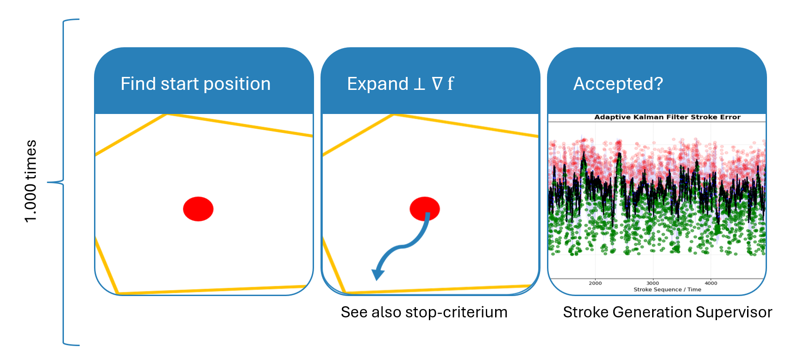

## Algorithm Overview

As with many problems it can be usefull to split the larger problem into smaller subproblems. In this case we try to achieve this by splitting our image into smaller segments (marked in yellow below). 

However, we're not done yet; we still need to solve those smaller problems. The algorithm used for this is quite simple. We look for a good starting position (taken approximately in the center of a cluster), and try to create a line by continiously expanding, perpendicular to the gradient. Thus for each of the 1000 strokes, we will do a few iterations, making small steps towards a stroke.
The gradient is calculated in advance for the entire image, based on a black and white version of the original image.

After a stopcriterion is met, we ask ourselves the question wether the generated stroke is worth it to render on the canvas. Hence, a stroke that only covers one additional pixel is very bad, since it is not worth the time to draw it. Moreover, a stroke that has too much color difference with the real image (e.g. drawing a red stroke on a blue sky), would make the image look worse than without it.
A so called [Stroke Generation Supervisor](stroke_generation_supervisor.md) will decide in real time if the stroke is accepted or not.

