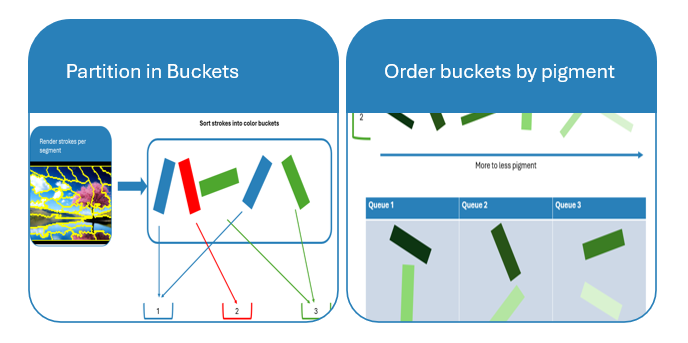
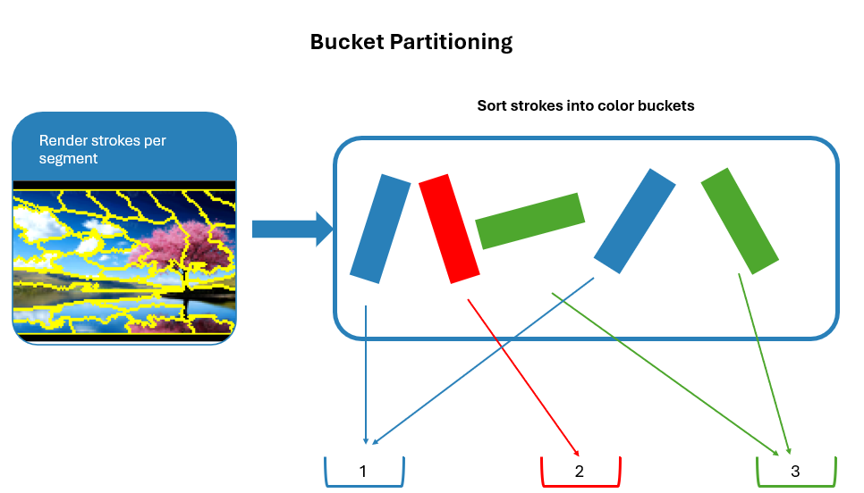
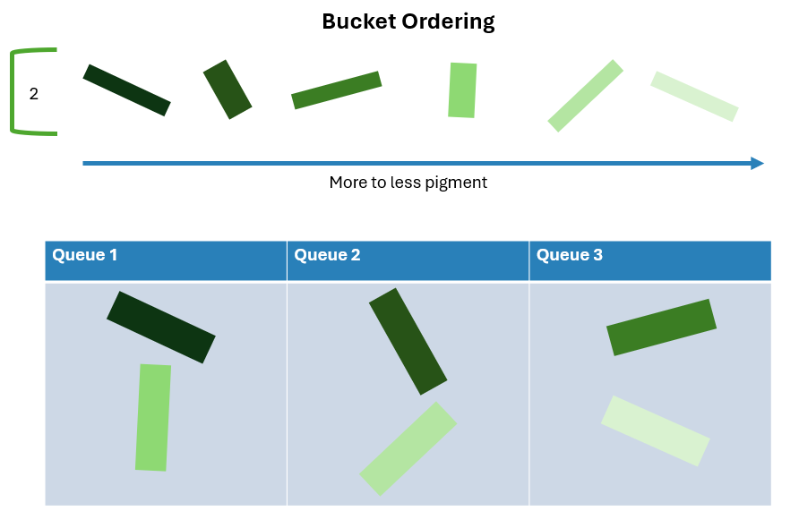

# Stroke Ordering

!!! failure "The Crux of the Problem: Stroke Ordering"
    Given a set of brush strokes, how should we order them
    so that the execution happens naturally, efficient,
    with an optimal result.

As a human painter, we will naturallly draw strokes that are further away fist, and gradually move closer to a subject.
For this, we could use a model that does monocular distance estimation.

On top of that, we also deal with problems in our physical world. 
When we want to change the paint color on our brush, we first have to clean 
our brush. This takes quite some time.
Thus, changing color should be kept to a minimum.

Moreover, travel distance between two subsequent strokes should also be minimized for a faster execution time.

Lastly, one should note that while drawing strokes the amount  of pigment on the brush decreases.
Indeed, that is the reason why we refill the brush every, say, 20 strokes.
Thus, brighter strokes should be placed later after a refill.

## Our Approach

Let's first note that there are many different ways to order the strokes, and that our approach is *not* the best solution.

Here's an overview of the stroke ordering.
First, all strokes are partitioned in what we call "color buckets", then each bucket is sorted by it's pigment. If that's not clear yet, dont worry. That's why we explain both steps in detail below.

First the strokes are partitioned. For this, we made sure that the stroke generation algorithm only used colors that are available
in our physical color palette.
Thus we need a finite amount of buckets,
12 for our color palette.

This partitioning is necessary to minimize the times we change the brush color, which costs a lot of time. Plus, changing color, no matter how extensive, will never work perfectly; there will always be some of the previous color left on the pencil. It is thus necessary to execute all of these buckets after one another, with no inverleaving.
We can, however, sort the order in which a
single bucket is executed. This is what we call *bucket ordering*.

As already mentioned, we dont want to
repetitively load our brush between
every single stroke. It would be nice if
we could do this only every, say, 20 strokes.
But, keep in mind that the pigment on our brush degraded over strokes. This doesnt have to be a downside though. Quite the oposite, we can order all strokes from more to less pigment. Then we place the stroke with most pigment on the start of the first queue. The
second most stroke is placed at the start of the second queue etc. We create 
$ \lceil \frac{ \text{\#strokes} }{ 20 } \rceil$ queues, so that
the queues are almost completely filled, 
and all queues have no more than 20 strokes.

In conclusion, these are the metrics we optimized:

| Metric | Status |
| :--- | :--- |
| Minimal color change | ✅  |
| Dark to bright |  ✅ |
| Far to near | ❌ |
| Minimal travel distance |  ❌ |