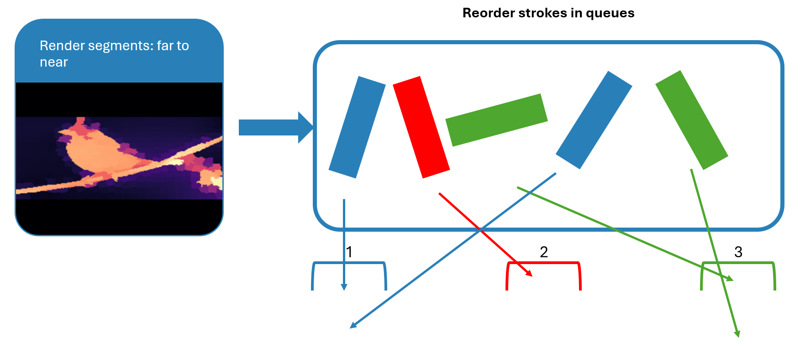

# Stroke Ordering

!!! failure "The Crux of the Problem: Stroke Ordering"
    How do we optimally order strokes so that the execution happens naturally and efficient?

    As a human painter, we will naturallly draw strokes that are further away fist, and gradually move closer to a subject. For this, we will use a model that does monocular distance estimation.

    On top of that, we also deal with problems in our physical world. 
    When we want to change the paint color on our brush, we first have to clean 
    our brush. This takes quite some time.
    Thus, changing color should be kept to a minimum.

    Moreover, travel distance between two subsequent strokes should also be minimized for a faster execution time.


## Our Approach

Let's first note that there are many different ways to order the strokes, and that our approach is *not* the best solution.

Since we could do distance estimation, we can order the segments by their average distance, from far to near.
We will render the strokes per segment in this order.

After this, we reorder the individual strokes by iterating over all strokes. If we encounter a stroke color, which we havent seen yet, we create a queue for this color. All subsequent strokes with this color are placed in this queue.
This ensures a minimal amount of color changing.


<sub>Illustration of our reordering approach.</sub>

It does not ensure however a minimal distance between two strokes.
Indeed, we could reorder each queue to minimize the distance between two strokes, so that the travel distance is minimized. This should save time when executing strokes.

For the less visual readers, we also provide the python code:

```python
# Dictionary to store lists of strokes grouped by color.
# Python 3.7+ dictionaries naturally preserve insertion order.
color_groups = {}

for stroke in self.strokes:
    # Ensure the color is a hashable tuple (handles lists/numpy arrays safely)
    color_key = tuple(stroke.color)
    
    if color_key not in color_groups:
        color_groups[color_key] = []
    color_groups[color_key].append(stroke)
    
# Reconstruct the flat list of strokes following the discovered color order
sorted_strokes = []
for color in color_groups:
    sorted_strokes.extend(color_groups[color])
    
self.strokes = sorted_strokes
```

In conclusion, these are the metrics we optimized:

| Metric | Status |
| :--- | :--- |
| Far to near |  ✔️ (good enough) |
| Minimal color change |  ✔️ |
| Minimal travel distance |  ❌ |