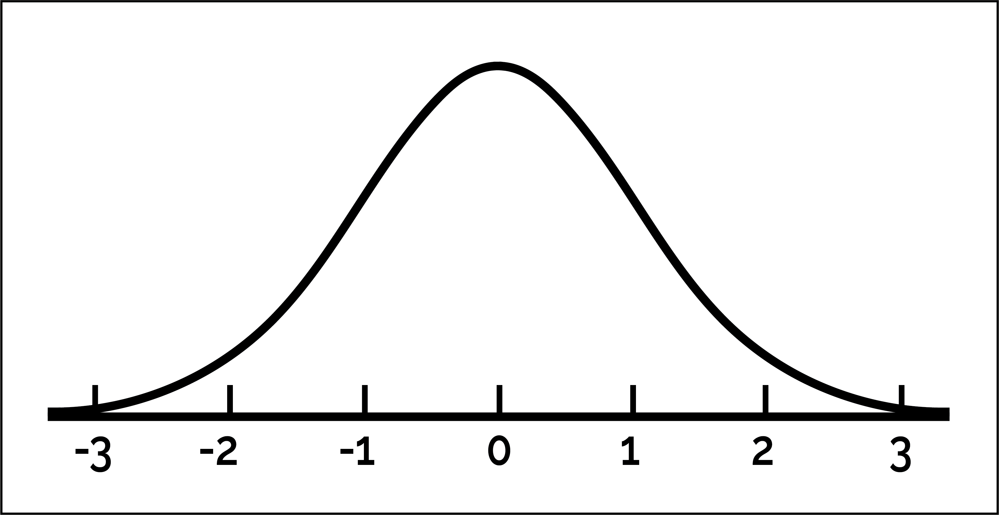
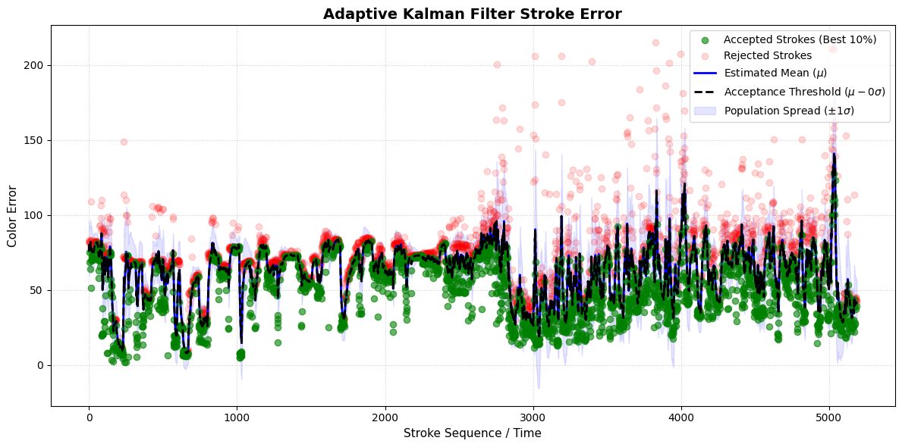

# Stroke Generation Supervisor
## About

Our `Stroke Generation Supervisor` its main task will be to decide which strokes
are accepted into the final result and which ones do not meet our quality requirements. See [Stroke Accepting](#stroke-accepting)
On top of that, it will hold some basic settings such as 
the attempts per segment, the target coverage and more. See [General Settings](#general-settings).

## Stroke Accepting

We use a Kalman Filter to accept the best strokes on the fly. We dynamically update a normal distribution to match the current color errors. We then use this normal distribution to select the best 50% of the strokes.

Let's plot this Kalman filter over time. In the plot below, you can see the mean of the normal
distribution in black. Strokes below the mean are accepted and displayed with green dots.
Strokes above the mean are colore red. 

We conclude from the figure that without this filter
strokes with very high color error would make it to the end result.
Thus, the kalman filter indeed is useful.

## General Settings

| Property Name | Description |
| :--- | :--- |
| `max_attempts` | Attempts to create a stroke, per segment |
| `supercell_target_coverage` | If we have more coverage than this, we wont try fitting. |
| `max_stroke_list_length` | The maximum length a list can have. |
| `min_stroke_length_pixels` | The maximum length a stroke can have, algebraically. |
| `max_error_threshold` | The maximum error a stroke can have with the original image. |
| `min_stroke_coverage_score` | The minimum stroke score a stroke must have. |
| `gradient_step_size` | The step size for iterative stroke generation. |